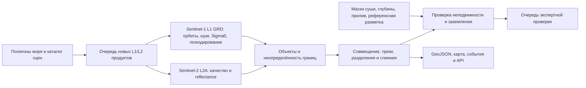

# Архитектура и приёмка

Требование: открытые спутниковые входы уровней L1/L2, пилот Карского моря,
поиск объектов от 30 м, мониторинг льдин и возможных стамух.

## Целевая схема

В версии 0.1 завершена оптическая последовательность до экспортируемых кандидатов
и базового сопоставления. SAR имеет поиск/загрузку, последовательный worker, шаблон SNAP и импорт:
исполнение полного SAR-контура в этой среде не подтверждено. Совместное
сопоставление двух сенсоров, экспертный интерфейс и API — следующий этап.

## Объекты и события

Разделить измерение и интерпретацию:

- Наблюдение: время UTC, полигон, площадь, размер, источник, канал/режим,
  доля пригодного покрытия, граница кадра/облака, версия алгоритма.
- Трек: наблюдения одного предполагаемого объекта, скорость и неопределённость,
  оценка неоднозначности. Исходные наблюдения неизменяемы.
- Гипотеза типа: морская льдина, обломок ледника/айсберг, торосистое образование,
  судно или неопределённая цель. NDSI не определяет происхождение льда.
- Заземление: отдельное поле с доказательствами и автором проверки.

`newly_observed` не доказывает рождение/откол: объект мог выйти из облаков или войти
в область. Для `breakaway_candidate` нужны граница припая/ледникового фронта,
до/после, родительский объект, совместимая площадь, проверка покрытия.
При split/merge хранить граф родителей и потомков; не выдавать несколько независимых
скоростей от одной неоднозначной пары.

## Стамухи

Стамуха — заземлённое торосистое скопление морского льда. Неподвижность также
возможна для припая, льда у берега, севшего на мель айсберга и ошибочно выделенной суши.
В 0.1 три пригодных наблюдения за ≥48 часов с малым изменением положения дают только
`stationary_candidate`; пороги условные и требуют настройки по контрольным объектам.

Следующий этап: уточнённая береговая линия, батиметрия с метаданными точности
(например, IBCAO/GEBCO для предварительного контекста), деформационная морфология,
движение окружающего льда, сезонная история и независимая проверка. Глубина сама
по себе не подтверждает контакт киля с дном. Лидар/альтиметрия по редким трекам
может помогать, но не заменяет оперативное площадное наблюдение.

## Два масштаба мониторинга

1. Обзор: всё Карское море плитками; VIIRS/MODIS L2 и SAR EW для крупных ледовых
   структур, качества покрытия и приоритетов детального анализа.
2. Детальный: береговые полигоны/объекты интереса на S2 10/20 м и S1 IW.
   30–100 м — отдельная группа кандидатов; крупнее 100 м — отдельная статистика.

Для всей российской Арктики разделять районы, сезоны, режимы съёмки и проекции.
В окрестности 180° разрезать полигоны на две части. Площади вычислять геодезически
или в подходящей равновеликой проекции; одна UTM-зона пригодна только для пилота.

## Операционная система после пилота

Каталог/очередь → отдельные рабочие процессы S2 и SNAP → объектное хранилище →
PostGIS для объектов/треков → сервис карты/API → очередь проверяемых событий.
SQLite и файловые выгрузки оставить для локального воспроизведения.

У каждого продукта сохранять идентификатор, оригинальный уровень, дату съёмки,
дату обнаружения в каталоге, дату обработки, провайдера, лицензионное указание,
контрольную сумму, baseline и версию конфигурации/кода. Калиброванный SAR не
переименовывать в официальный «Sentinel-1 L2»: его исходный уровень L1 сохраняется.
Собственные карты объектов — производный результат; требование L1/L2 относится к входам.

Планировщик: окно с перекрытием, дедупликация по версии продукта, ограничение загрузок,
отдельные очереди ошибок/повторов, поздние сцены и перепроцессинг, контроль свободного
диска. Измерять возраст последнего пригодного наблюдения по каждой ячейке, а не
только успешность задания. Эксплуатационные уведомления посылать при изменениях,
ошибках или необходимости проверки; не дублировать одинаковые события.

Не обещать SLA съёмки: открытые архивы, распределение режимов и наличие публикаций
зависят от поставщиков. Оценить фактическую доступность за 6–12 месяцев по полигону.
Цель задержки обработки после появления продукта устанавливать после замеров.

## Проверяемая приёмка

Сначала составить независимую разметку по выбранным дням и разным условиям.
Разделять обучение/настройку и тестирование по датам и районам; соседние тайлы
одного пролёта не должны попадать в разные группы.

| Проверка | Как измерять |
|---|---|
| Обнаружение | Precision/recall отдельно для 30–60, 60–100 и >100 м; по сенсору и сезону |
| Ложные цели | Число на 100 км²; отдельно облака, суда, суша, волны |
| Границы | IoU и ошибка площади/положения с учётом неопределённости эталона |
| Трекинг | Ошибки идентичности, ложные связи, разрывы, ошибка скорости |
| Стамухи | Только по независимо подтверждённым заземлённым образованиям |
| Покрытие | Доля AOI с пригодным наблюдением и возраст по ячейкам |
| Оперативность | От съёмки до публикации; от публикации до результата, p50/p95 |
| Надёжность | Сетевые сбои, пустой каталог, NoData, дубликаты, поздние сцены, рестарт |

Числовые целевые precision/recall сейчас не заданы: сначала установить достижимые
значения на реальной выборке. Синтетические тесты проверяют логику программы,
но не научную точность обнаружения. Архивный запуск не доказывает оперативность.

## Очерёдность внедрения

1. Уточнить прибрежные рабочие полигоны и контрольные стамухи; проверить реальную
   доступность S2/S1 и размерные требования на архиве.
2. Запустить SNAP на IW/EW GRD, сохранить контрольные сцены и сверить калибровку/
   геометрию; проверить автоматический SAR worker и обновление токенов.
3. Заменить пороговые детекторы на валидированную сегментацию, научить различать
   суда и лёд, добавить мозаики, регистрацию и устойчивый трекер со split/merge.
4. Подключить контекст глубин и экспертные решения по кандидатам в стамухи.
5. Развернуть сервер, провести непрерывный пилот и принять систему по согласованным метрикам.
