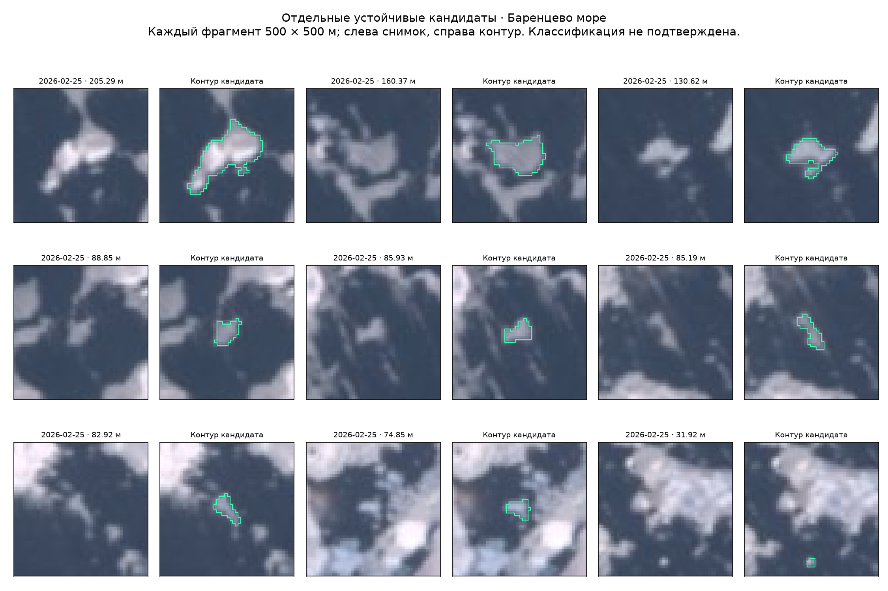

# Частичная объектная карта зимы 2025/26

**5 участков, 500 км².** 215 наблюдений кандидатов, из них 29 устойчивых без
искусственных разделений. Подтверждённых стамух нет. Полнота обнаружения от 30 м
и покрытие всей Арктики не достигнуты.

Скачайте [map.html](map.html) и откройте в браузере; изображения встроены.
Это большая географическая карта всей аналитической области Арктики: три
месячные радарные мозаики и пять участков в общей проекции. Нажмите на участок,
выберите оптику или радар, дату и объект. Кнопка «Вся Арктика» возвращает обзор.
Доступны 15 оптических и 20 радиолокационных снимков. Расширение интерфейса не
расширяет область объектной обработки: она по-прежнему составляет 500 км².

По умолчанию показаны 29 консервативных кандидатов на двух датах Баренцева моря;
на карте одновременно видна одна дата каждого участка. Остальные контуры
включаются флажком «Также спорные контуры».
Для каждого объекта доступны координаты, дата, размер и исходная сцена.

[Методика и запуск](../../docs/object-map.md) · [Площадь обработки](coverage.png).
GeoJSON — WGS84; числа относятся к наблюдениям, а не уникальным отслеженным льдинам.
Полные растры и маски переданы отдельно; большие бинарные файлы в Git не включены.
