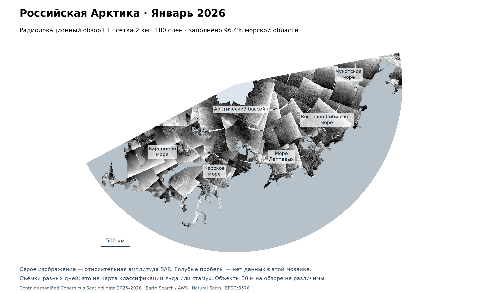

# Зимние карты российской Арктики 2025/26

Реальные Sentinel-1 GRD L1, обзорная сетка 2 км. Это не классификация льда
или стамух; отдельные объекты 30 м здесь не различимы.

- [Декабрь 2025](radar-2025-12.png)
- [Январь 2026](radar-2026-01.png)
- [Февраль 2026](radar-2026-02.png)
- [Доступность IW и EW](coverage-IW-EW-january.png)
- [Методика, значения слоёв и ограничения](../../docs/winter-atlas.md)

GeoTIFF сохраняют яркость, дату и индекс исходной сцены для каждого пикселя.
Список сцен и адреса исходных файлов — в соответствующем `status.json`.
Все времена UTC. GeoJSON показывает контуры доступных сцен и аналитическую
область, а не границы льдин или государственные границы.
